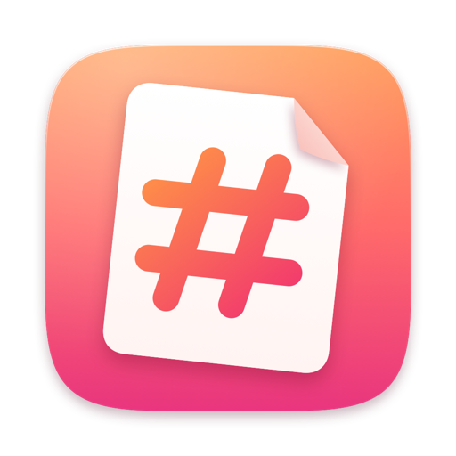
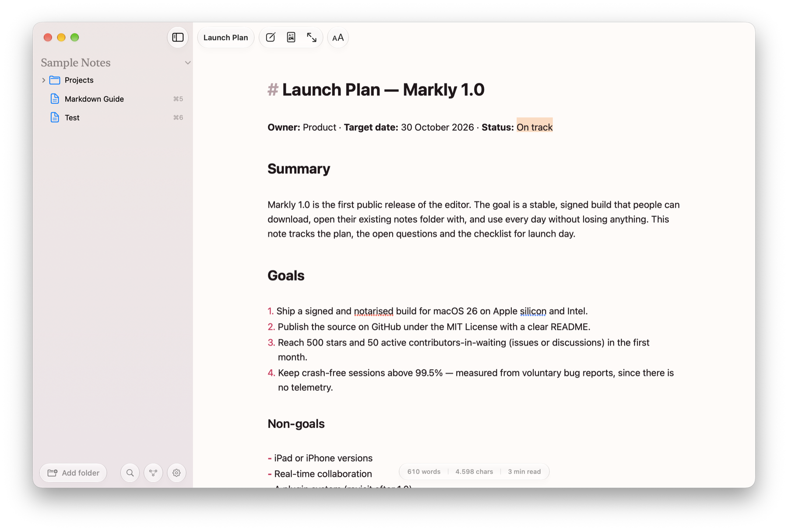

<div align="center">



# Markly

### A *calm* Markdown editor for your folders.

Point Markly at any folder and it edits your `.md` files in place: no import, no database, no lock-in.<br>
Built with SwiftUI, AppKit and Apple's native Liquid Glass. No Electron.

[](https://github.com/muhghazaliakbar/markly/releases/latest)
[](#download)
[](#download)
[](LICENSE)

**[Download for macOS](https://github.com/muhghazaliakbar/markly/releases/latest)** · [Features](#everything-renders-as-you-type) · [Shortcuts](#made-for-the-keyboard) · [Build from source](#build-from-source) · [Contribute](#contributing)

<br>

<picture>
  <source media="(prefers-color-scheme: dark)" srcset=".github/assets/screenshot-dark.png">
  
</picture>

</div>

<br>

> **Your notes stay plain `.md` files in the folders you already have.**<br>
> **No import, no database, no lock-in.**

<br>

## Everything renders as you type.

Headings, bold, italic, strikethrough, `==highlights==`, links, inline code, code blocks, quotes, tables, math and task lists. The syntax gets out of the way until you need it: markers like `**` and `#` collapse on lines you aren't editing and reappear when the caret moves there. (You can also always show them, or never.)

<table>
<tr>
<td width="50%" valign="top">

#### ✦ Format bar on selection

Select text and a Liquid Glass bar appears above it: bold, italic, strikethrough, highlight, inline code, link (with an inline URL field, prefilled from the clipboard), heading and quote. Active formats are lit; pressing one again removes it.

</td>
<td width="50%" valign="top">

#### ☑ Clickable tasks

Click `[ ]` to check it off. Return continues a list (numbers go up, checkboxes reset), Tab / ⇧Tab indents, and ⌘-click opens a link — relative `.md` links open right inside the editor.

</td>
</tr>
<tr>
<td width="50%" valign="top">

#### ⎇ Git sync from the sidebar

A button shows the branch and pending changes. One click commits, pulls (rebase) and pushes, or initializes a new repository. Sync is scoped to your notes folder, so notes living inside a bigger repo never drag unrelated changes along.

</td>
<td width="50%" valign="top">

#### ◐ Focus on paragraph

Everything but the paragraph you're in dims. Typewriter scrolling keeps the line you're writing centred, and Focus mode (⇧⌘F) hides everything but the page.

</td>
</tr>
<tr>
<td width="50%" valign="top">

#### ◫ Preview pane

GitHub-style rendering with KaTeX math and syntax highlighting (⌥⌘P), scroll-synced with the editor in both directions. Export to HTML or PDF, or print.

</td>
<td width="50%" valign="top">

#### ▤ Folders, not libraries

Add as many folders as you like, browse nested notes and filter by name (⇧⌘L). Changes save to the original file, and files edited elsewhere (git, other editors) reload on their own.

</td>
</tr>
</table>

**Also in Markly:** inline image previews · smart lists · a floating *Aa* editor panel (⌥⌘I) for typeface, size, spacing and width · light, dark or auto · custom accent color · signed automatic updates · export to HTML and PDF.

<details>
<summary><b>Everything in Settings</b></summary>

<br>

- **Editor panel** (⌥⌘I or the Aa button): text size, typeface, inline image previews, syntax visibility, line spacing, editor width and spell checking. The page stays sharp and editable beside it, so changes show up immediately.
- **General:** appearance (Light, Dark, Auto), accent color (the Markly theme, presets or any custom color), reopen last note, word count, file extension for new notes.
- **Editor:** smart lists, typewriter scrolling, focus on paragraph, format bar, preview scroll sync, note transition animation.
- **Privacy:** turn off the preview's CDN scripts (KaTeX, highlight.js) and remote images, and choose whether Markly checks for updates.
- **Shortcuts** and **About:** version, open-source notices, copy diagnostics, reset all settings.

</details>

## Made for the keyboard.

| Action | Shortcut | Action | Shortcut |
| --- | :---: | --- | :---: |
| Bold | <kbd>⌘</kbd> <kbd>B</kbd> | Heading 1–4 | <kbd>⌥</kbd> <kbd>⌘</kbd> <kbd>1–4</kbd> |
| Italic | <kbd>⌘</kbd> <kbd>I</kbd> | Body text | <kbd>⌥</kbd> <kbd>⌘</kbd> <kbd>0</kbd> |
| Strikethrough | <kbd>⇧</kbd> <kbd>⌘</kbd> <kbd>X</kbd> | Bulleted list | <kbd>⇧</kbd> <kbd>⌘</kbd> <kbd>8</kbd> |
| Highlight | <kbd>⇧</kbd> <kbd>⌘</kbd> <kbd>H</kbd> | Numbered list | <kbd>⇧</kbd> <kbd>⌘</kbd> <kbd>7</kbd> |
| Inline code | <kbd>⌘</kbd> <kbd>E</kbd> | Task list | <kbd>⇧</kbd> <kbd>⌘</kbd> <kbd>T</kbd> |
| Link | <kbd>⌘</kbd> <kbd>K</kbd> | Quote | <kbd>⌘</kbd> <kbd>'</kbd> |
| Code block | <kbd>⌥</kbd> <kbd>⌘</kbd> <kbd>C</kbd> | Table | <kbd>⌥</kbd> <kbd>⌘</kbd> <kbd>T</kbd> |
| Preview | <kbd>⌥</kbd> <kbd>⌘</kbd> <kbd>P</kbd> | Focus mode | <kbd>⇧</kbd> <kbd>⌘</kbd> <kbd>F</kbd> |
| Bigger / smaller text | <kbd>⌘</kbd> <kbd>+</kbd> / <kbd>-</kbd> | Add folder | <kbd>⌘</kbd> <kbd>O</kbd> |
| Open note 1–9 | <kbd>⌘</kbd> <kbd>1–9</kbd> | Editor settings | <kbd>⌥</kbd> <kbd>⌘</kbd> <kbd>I</kbd> |
| App settings | <kbd>⌘</kbd> <kbd>,</kbd> | Filter notes | <kbd>⇧</kbd> <kbd>⌘</kbd> <kbd>L</kbd> |

## Calm by design.

- **Native, not Electron.** Built with SwiftUI and AppKit (TextKit) and Apple's Liquid Glass. Typing stays fast on long notes thanks to incremental highlighting.
- **No accounts, analytics or tracking.** Turn off the preview's CDN scripts and remote images; both are enforced with a Content-Security-Policy. Update checks are off until you agree to them. The editor works fully offline.
- **MIT licensed.** Issues and pull requests are welcome.

## Download

1. Grab the latest `Markly-x.y.z.dmg` from **[Releases](https://github.com/muhghazaliakbar/markly/releases/latest)**.
2. Open it and drag **Markly** to **Applications**.
3. Add a folder of notes (⌘O) and start writing.

Requires macOS 26 (Tahoe) or later; the app is universal (Apple silicon and Intel).

> [!NOTE]
> If a release is not notarised, macOS blocks it the first time you open it. Go to **System Settings › Privacy & Security** and click **Open Anyway**, or run `xattr -dr com.apple.quarantine /Applications/Markly.app`.

After that, Markly keeps itself up to date: choose **Markly › Check for Updates…**, or allow automatic checks when Markly asks on its second launch (Settings › Privacy › Updates). Updates come from this repository's releases and are verified with Markly's EdDSA signing key ([Sparkle](https://sparkle-project.org)).

## Build from source

Requires macOS 26 (Tahoe) or later and Xcode 26+, because the interface uses the Liquid Glass APIs (`glassEffect`, `GlassEffectContainer`, glass button styles).

```bash
git clone git@github.com:muhghazaliakbar/markly.git
cd markly
scripts/build-app.sh            # builds build/Markly.app (universal, ad-hoc signed)
scripts/build-app.sh --install  # also copies it to /Applications
```

For development, open `Package.swift` in Xcode and run the `Markly` scheme, or use `swift run`. Run the tests with `swift test`.

CI (`.github/workflows/ci.yml`) builds and tests every push and pull request. Pushing a `vX.Y.Z` tag runs `.github/workflows/release.yml`, which builds the universal app, packages it with `scripts/make-dmg.sh` and publishes a GitHub release with the DMG, a zip, checksums and `appcast.xml`, the feed in-app updates read from `releases/latest/download/appcast.xml` (`scripts/make-appcast.sh`; needs the `SPARKLE_PRIVATE_KEY` secret).

<details>
<summary><b>Project layout</b></summary>

<br>

| File | Purpose |
| --- | --- |
| `MarklyApp.swift` | App entry, menus and keyboard shortcuts |
| `Workspace.swift` | Sidebar folders, file tree, open/save/autosave, external change reload |
| `ContentView.swift`, `SidebarView.swift` | Window layout, sidebar, status pill, toolbar |
| `EditorView.swift` | SwiftUI ↔ `NSTextView` bridge, per-note state, focus dim, typewriter scrolling |
| `MarkdownTextView.swift` | Editor text view (formatting actions, smart lists, checkboxes, links) and layout manager (block decorations) |
| `MarkdownHighlighter.swift` | Incremental live Markdown styling and syntax hiding |
| `MarkdownRenderer.swift`, `PreviewView.swift` | HTML rendering, preview pane, export and printing |
| `ScrollSync.swift` | Editor ⇄ preview scroll sync |
| `SelectionToolbar.swift` | Format bar on selection |
| `EditorSettingsPanel.swift` | Floating editor settings panel |
| `AppSettingsView.swift` | Settings window (General, Editor, Privacy, Shortcuts, About) |
| `EditorPreviewSplit.swift` | Resizable editor/preview split |
| `GlassControls.swift` | Liquid Glass building blocks: segmented picker, tiles, tick slider, chips, progressive blur |
| `GitViews.swift`, `GitService.swift` | Sidebar Git button and sync card, `git` CLI wrapper |
| `ImageStore.swift` | Loads and caches inline image previews |
| `Updater.swift` | Sparkle updater and "Check for Updates…" |
| `Theme.swift`, `Settings.swift` | Markly brand theme, preference keys and enums |

HTML rendering uses [swift-markdown](https://github.com/swiftlang/swift-markdown) (GitHub-flavored Markdown). The preview loads KaTeX and highlight.js from jsdelivr, so math and code coloring in the preview need a network connection.

</details>

## Roadmap ideas

- Pasting and dragging images into a folder next to the note
- GitHub sign-in and repository creation
- Outline / table-of-contents panel
- Full-text search across the folder

## Contributing

Issues and pull requests are welcome. [AGENTS.md](AGENTS.md) describes the architecture, the design and performance rules, and lessons learned. It's written for human contributors and AI coding agents alike (Claude Code picks it up through [CLAUDE.md](CLAUDE.md) and the project skills in `.claude/skills/`).

## Support

Markly is free and always will be. If it earns a spot in your day, you can keep it going:

<a href="https://buymeacoffee.com/justghali.dev"></a>

## License

[MIT](LICENSE) © Markly contributors
