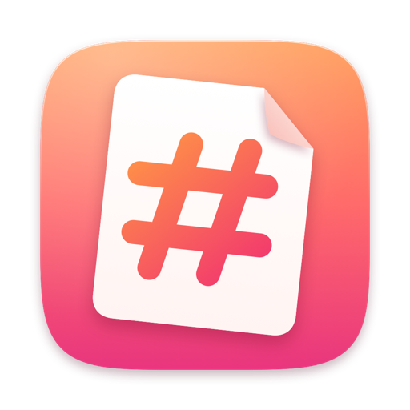

# Welcome to Markly

Markly is a **native**, *open-source* Markdown editor for macOS. It edits the Markdown files in your folders directly — there's no library to import into and nothing to export out of. Syntax like `**` and `#` fades away when you're not editing a line; click into a line to see it again.

This note is a tour. Scroll down, open the preview with ⌥⌘P and watch it follow along, or open the editor panel with ⌥⌘I and change the typography while you read.



## Writing

Markly styles your text as you type. Headings grow, **bold** gets heavier, *italic* leans, ~~strikethrough~~ crosses out and ==highlights== glow. Inline `code` switches to a monospaced font with a soft background.

Select any word and a floating format bar appears above it. It works like Medium's inline editor: bold, italic, strikethrough, highlight, code, link, two heading sizes and a quote. A lit button means the format is already applied — press it again to remove it.

### Links

Links look like links: [Markly on GitHub](https://github.com) and [Apple's Human Interface Guidelines](https://developer.apple.com/design/human-interface-guidelines/). Hold ⌘ and click to open one. Links to other notes open right here in the editor — try [the roadmap](Projects/Roadmap.md) or [the Markdown guide](Markdown%20Guide.md).

Bare addresses such as https://www.markdownguide.org are recognised too.

### Lists that keep up

- Press Return at the end of an item and the next bullet appears on its own
- Press Return on an empty item to end the list
- Tab and ⇧Tab indent and outdent
    - like this nested item
    - and this one
- Numbered lists count up for you:

1. Open a folder
2. Pick a note
3. Start writing
4. There is no step four — it's already saved

### Tasks

- [x] Live Markdown styling
- [x] Folder sidebar with ⌘1–⌘9 shortcuts
- [x] Format bar on selection
- [x] Preview that scrolls with the editor
- [ ] Click this checkbox to tick it
- [ ] And this one, to see the strikethrough

## Quotes

> Simplicity is the ultimate sophistication.
>
> Quotes get a soft accent bar on the left. Long quotes wrap neatly and keep their indent, so a paragraph of quoted text still reads like one block instead of a ragged column.

> > Nested quotes stack their bars.

## Code

Fenced code blocks get a rounded background in the editor and full syntax colouring in the preview:

```swift
import SwiftUI

struct Greeting: View {
    var name: String

    var body: some View {
        Text("Hello, \(name)")
            .font(.largeTitle)
            .glassEffect()
    }
}
```

```python
def fibonacci(n: int) -> list[int]:
    """Return the first n Fibonacci numbers."""
    numbers = [0, 1]
    while len(numbers) < n:
        numbers.append(numbers[-1] + numbers[-2])
    return numbers[:n]

print(fibonacci(10))
```

```bash
# Build Markly from source
git clone https://github.com/you/markly.git
cd markly
scripts/build-app.sh --install
```

## Math

Inline math sits in a sentence, like Euler's identity $e^{i\pi} + 1 = 0$ or the area of a circle $A = \pi r^2$. Display math gets its own line:

$$
\int_{-\infty}^{\infty} e^{-x^2} \, dx = \sqrt{\pi}
$$

$$
f(x) = \sum_{n=0}^{\infty} \frac{f^{(n)}(a)}{n!} (x - a)^n
$$

## Tables

| Shortcut | Action              | Where          |
| -------- | ------------------- | -------------- |
| ⌘B       | Bold                | Format menu    |
| ⌘I       | Italic              | Format menu    |
| ⌘K       | Link                | Format menu    |
| ⌥⌘1–4    | Heading 1–4         | Format menu    |
| ⌥⌘P      | Preview             | View menu      |
| ⌥⌘I      | Editor settings     | View menu      |
| ⇧⌘F      | Focus mode          | View menu      |
| ⌘,       | App settings        | Markly menu    |

Columns line up because table rows use a monospaced font while you edit them.

## Focus

When you want nothing but the words, press ⇧⌘F. The sidebar and toolbar step aside and the page takes the whole window. Press it again, or the button in the corner, to come back.

In **Settings › Editor** you'll find two more ways to concentrate:

- **Typewriter scrolling** keeps the line you're writing in the middle of the window, so your eyes never have to travel to the bottom of the screen.
- **Focus on paragraph** dims everything except the paragraph under the caret.

## Your files, your folders

Markly never moves your notes into a database. Add any folder with ⌘O — a notes folder, a project's `docs` directory, a blog repository — and it shows every Markdown file inside, nested folders included. Changes are saved automatically a moment after you stop typing, and files edited elsewhere (by git, another editor or a sync service) reload on their own when you come back to Markly.

Each note remembers where you were: its scroll position, the caret and its own undo history. Switch between notes with ⌘1–⌘9 or the sidebar and pick up exactly where you left off.

## Privacy

Markly has no accounts, analytics or tracking. The only network requests are the ones you allow in **Settings › Privacy**: the preview's math and code styling scripts, images from the web, and Git sync when you press Sync.

---

That's the tour. Delete this note whenever you like — or keep it around as a playground.
